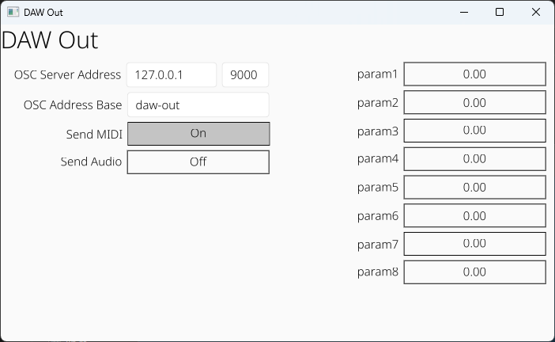

# DAW Out

VST3/CLAP Plugin for MIDI/OSC output from a DAW to an OSC Server



## Releases

Download the latest release [here](https://github.com/gamingrobot/daw-out/releases)

## OSC Messages

`osc_address_base` maps to the `OSC Address Base` specified in the plugin GUI

### MIDI

#### Note On

`/<osc_address_base>/note_on <channel> <note> <velocity>`

#### Note Off

`/<osc_address_base>/note_off <channel> <note> <velocity>`

### Parameters

param1-param8 that can be modified by automation

`/<osc_address_base>/param/<param_name> <param_value>`

### Audio

**NOTE: Audio sending is disabled by default, enable `Send Audio` in the plugin GUI**

Downsampled audio as individual OSC messages ~100hz

`/<osc_address_base>/audio <sample_value>`

## Building

```sh
cargo xtask bundle daw-out --release
```
